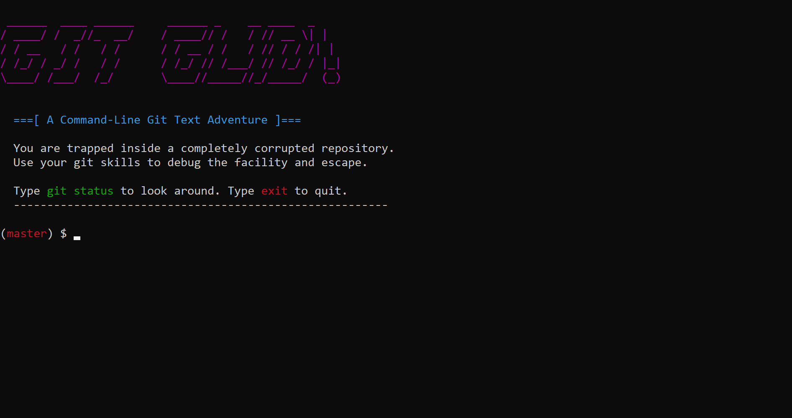

Git Gud - A CLI Git Text Adventure
=================================

Git Gud is a small command-line game that teaches basic Git concepts through a short
text adventure. You are trapped in a corrupted repository and must use familiar Git
commands to escape.

Live Website
------------
https://jerome-mondol.github.io/git-gud/

Screenshot
----------



Features
--------
- Two-branch story flow (master -> basement)
- Guided hints and friendly error messages
- Colorized terminal output
- Short and replayable

Requirements
------------
- C++ compiler with C++11 support (g++, clang++, or MSVC)
- A terminal that supports ANSI colors

On Windows, the game enables ANSI support automatically. If you do not see colors,
try Windows Terminal, PowerShell, or a modern terminal emulator.

Install
-------
Clone the repository:

```
git clone https://github.com/Jerome-Mondol/git-gud.git
```

Then change into the project folder:

```
cd git-gud
```

Build
-----
From this folder:

Using g++ (MinGW or MSYS2):
```
g++ git-gud.cpp -o git-gud
```

Using clang++:
```
clang++ git-gud.cpp -o git-gud
```

Using MSVC (Developer Command Prompt):
```
cl /EHsc git-gud.cpp
```

Run
---
```
./git-gud
```

If you built with MSVC on Windows, run:
```
git-gud.exe
```

How To Play
----------
The simulator only accepts Git commands. Start by checking your status:

```
git status
```

Core commands used in the game:
- git status
- git add <file>
- git commit -m "message"
- git checkout <branch>
- exit

Tips
----
- If a command is rejected, read the hint and try again.
- The game is short. You can restart any time by closing and re-running.

Spoiler-Free Goals
------------------
1) Discover the first useful file.
2) Save your progress with a commit.
3) Switch to the next branch and finish the escape.

License
-------
MIT
